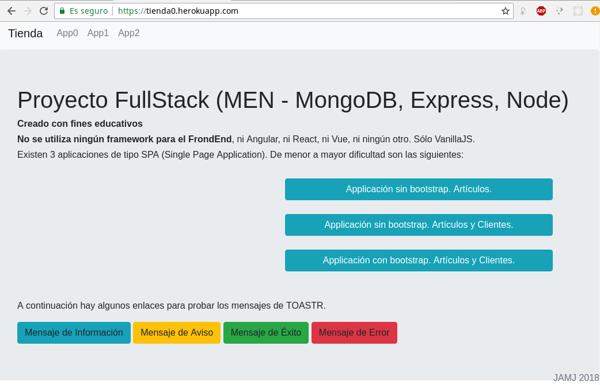
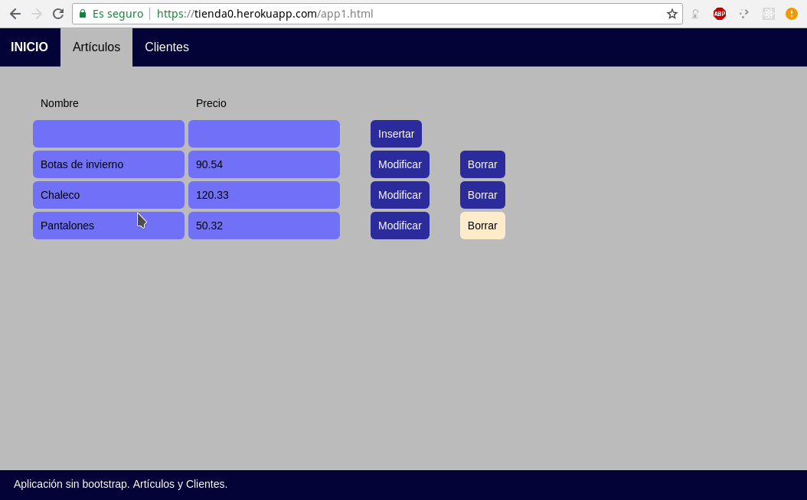
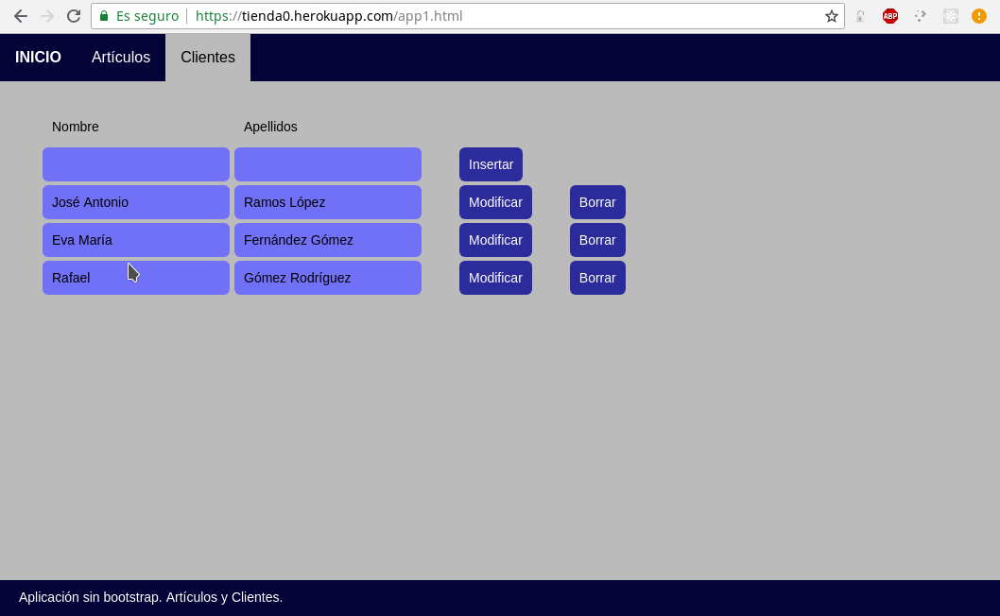
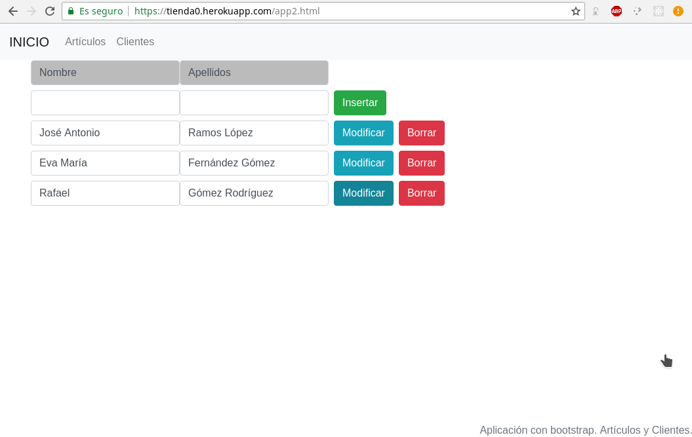
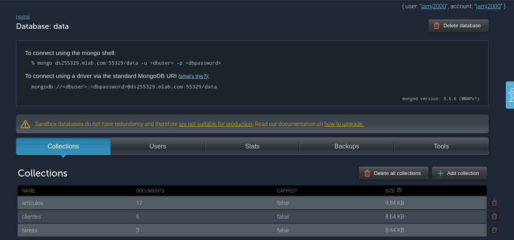

# tienda0
# Proyecto Fullstack con NODEJS + EXPRESS + MONGODB

[](http://vanilla-js.com/)


## Introducción

Este es un proyecto realizado con fines educativos. 

Se utilizan los mínimos recursos (ya sean estos paquetes, librerías o frameworks). Tambien se intenta minimizar el número de archivos utilizados. Este proyecto **NO** necesita de frameworks como Angular, React o Vue para el FrondEnd, ya que hacemos uso de [VanillaJS](http://vanilla-js.com/) ( **~~MEAN~~**, **~~MERN~~**, **~~MEVN~~**  ). 

Existen 3 aplicaciones web dentro de proyecto, denominadas App0, App1 y App2. Cada una de ellas es una SPA (Single Page Application).








Los archivos utilizados son los siguientes:


```
├── config.js
├── index.js
├── models.js
├── package.for.react.json
├── package.json
├── package-lock.json
├── public
│   ├── app0.html
│   ├── app1.html
│   ├── app2.html
│   ├── css
│   │   ├── bootstrap.min.css
│   │   └── toastr.css
│   ├── favicon.png
│   ├── index.html
│   └── js
│       ├── bootstrap.min.js
│       ├── jquery-1.9.1.min.js
│       ├── jquery-migrate-1.2.1.min.js
│       └── toastr.js
├── README.md
└── routes.js
```


Para el BackEnd los archivos necesarios son:

- package.json
- index.js
- config.js
- models.js
- routes.js

Para el FrontEnd los archivos necesarios, según la App, son:

- App0
  - public/favicon.png
  - public/app0.html
  
- App1
  - public/favicon.png
  - public/app1.html
  
- App2
  - public/favicon.png
  - public/app2.html
  - public/css/*
  - public/js/*
  
La página `public/index.html` da acceso a las 3 applicaciones.


## Despliegue en local

Para poder ejecutar este proyecto en tu equipo local, sigue los siguientes pasos: 

1. Instala el servidor MongoDB. [Consulta la página oficial](https://docs.mongodb.com/manual/installation/).
2. Clona este repositorio en tu equipo:
  ```bash
  git  clone  https://github.com/jamj2000/tienda0.git
  cd   tienda0
  ```
3. Instala los módulos necesarios;
  ```bash
  npm  install
  ```
4. Inicia la aplicación
  ```bash
  npm  start
  ```
5. Abre en el navegador web la URL `http://localhost:3000`.
  

## Despliegue en Docker

Si deseas mantener limpio tu equipo y no tener que instalar Nodejs ni MongoDB, entonces puedes utilizar Docker.

Para ello, sigue los siguientes pasos:

1. Clona este repositorio en tu equipo:
  ```bash
  git  clone  https://github.com/jamj2000/tienda0.git
  cd   tienda0
  ```
  
2. Instala el software para Docker. En Ubuntu:

  ```bash
  sudo  apt  install  docker.io  docker-compose
  sudo  adduser  `id -un`  docker
  ```
  Cerrar sesión y volver a iniciar sesión

3. Dentro de la carpeta que contiene el código, ejecuta: 

  ```bash
  docker-compose  up  -d
  ```

> NOTA: Los puertos 80 y 27017 no deben estar ocupados por ningún servicio previo. Son necesarios para los servicios de Node y Mongo que lanzará Docker.


## Despliegue en Internet

Actualmente la aplicación está desplegada en [HEROKU](https://www.heroku.com). Como base de datos utiliza DBaaS MySQL proporcionado por [MLAB](https://mlab.com).

Si deseas hacer un despligue usando los servicios proporcionados por los sitios anteriores, sigue estos pasos: 

1. Create una cuenta en Heroku. Éste tiene varios [planes](https://www.heroku.com/pricing). Registrate en el plan Free, que aunque está algo limitado es gratis. Aún así se te solicitará un número de tarjeta. Tenlo en cuenta.


2. Instala la herramienta `heroku-cli`. En [este enlace](https://devcenter.heroku.com/articles/heroku-cli) tienes la información necesaria.

3. Clona este repositorio en tu equipo:
  ```bash
  git  clone  https://github.com/jamj2000/tienda0.git
  cd   tienda0
  ```

4. Inicia sesión desde el terminal en la cuenta que previamente creaste en Heroku. Y crea una nueva aplicación. 
  
  ```bash
  heroku login
  heroku create --region eu  nombre_aplicacion
  ```
  
  **NOTA:** Debes sustituir `nombre_aplicacion` por el nombre que desees dar a tu aplicación. Ten en cuenta que no puede tener espacios en blanco ni tildes. Probablemente tengas que probar con varios nombres, pues muchos de ellos ya están ocupados. La opción `--region eu` es para que la aplicación se aloje en servidores de Europa. 
  
5. Despliega el código en Heroku.

  ```bash
  heroku  push  heroku  master
  ```

  Dentro de unos instantes podrás acceder a la aplicación en la url `http://nombre_aplicacion.herokuapp.com`. 
  
  **NOTA:** Debes sustituir `nombre_aplicacion` por el nombre de tu aplicación.
  
  Puedes verla abriendo dicha url en el navegador o ejecutando
  
  ```bash
  heroku  open
  ```
  
6. ¿Y los datos?
  
  Los datos de la aplicación se guardan en una base de datos. En este caso hemos usado el DBaaS que nos proporciona [mLab](https://mlab.com). 
  
    
7. Este sitio tiene varios [planes](https://mlab.com/plans/). Escoge el plan Free, que aunque está algo limitado es gratis. 

8. Crea una base de datos MongoDB y apunta los parámetros de configuración.
  
  En concreto deberás anotar 5 datos:
  - El nombre o IP de host donde se aloja la base de datos.
  - El puerto.
  - El nombre de la base de datos.
  - El nombre del usuario.
  - La contraseña de dicho usuario.
  
  

9. Vuelve a la web de Heroku, inicia sesión, selecciona tu aplicación y pincha en el apartado `Settings` y luego en el botón `Reveal Config Vars`. Crea las variables de entorno que se muestran a continuación con los datos que recopilaste en el apartado anterior.

  
  

10. En la parte superior derecha de la página, pulsa en el boton `More` y luego en `Restart all dynos`.

  
  


